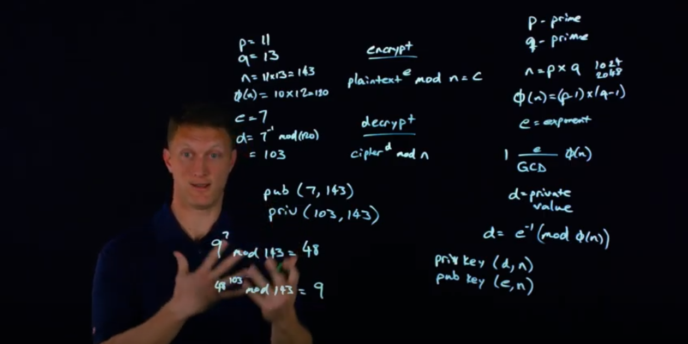

```
Decrypt my super sick RSA:
c: 62324783949134119159408816513334912534343517300880137691662780895409992760262021
n: 1280678415822214057864524798453297819181910621573945477544758171055968245116423923
e: 65537
```
[https://www.youtube.com/watch?v=rVQpK6NcYIE](https://www.youtube.com/watch?v=rVQpK6NcYIE) `e^a mod b` is Modular exponentiation `pow(e, a, b)`


`n = p*q` factorDB : Collective Factorization for Relational Data. Collective Factorization for Relational Data Project Contributors. Nitish Gupta
[http://factordb.com/](http://factordb.com/)

```
p = 1899107986527483535344517113948531328331
q = 674357869540600933870145899564746495319033
phi = (p-1)*(q-1) = 128067841582214057864524798453297819181234364596418349127352680639289550089776560
```

```python
n = 1280678415822214057864524798453297819181910621573945477544758171055968245116423923
p = 1899107986527483535344517113948531328331
q = 674357869540600933870145899564746495319033

e = 65537

# cipher text
c = 62324783949134119159408816513334912534343517300880137691662780895409992760262021


# loop through prime factors and multiply them together with (factor-1)*(nextFactor-1)...

phi = (p-1)*(q-1)

# inverse pow (3.8+ syntax, for previous versions of python use gmpy2.invert)
d = pow(e, -1, phi)

# solve for the answer
ans = pow(c, d, n)

# print the answer
print(bytes.fromhex(hex(ans)[2:]).decode('ascii'))
```
thanks to [https://github.com/Kasimir123/CTFWriteUps/tree/main/2021-03-picoCTF/Mind-your-Ps-and-Qs](https://github.com/Kasimir123/CTFWriteUps/tree/main/2021-03-picoCTF/Mind-your-Ps-and-Qs)